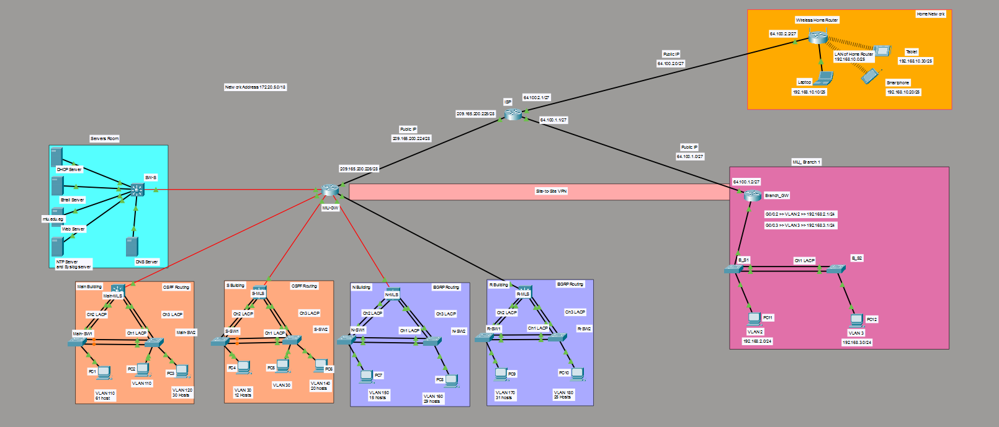

# University-Campus-Network-Simulation
# CCNA Networking Project

## Overview

This project was completed as part of our CCNA coursework and demonstrates the implementation of various networking concepts in a simulated enterprise network environment using Cisco Packet Tracer.

## Networking Concepts Implemented

This project incorporates a wide range of CCNA networking concepts, including:

* IPv4 Addressing and Subnetting
* VLAN Configuration
* Trunking (802.1Q)
* Inter-VLAN Routing
* Static Routing
* OSPF Dynamic Routing
* DHCP Configuration
* NAT
* Spanning Tree Protocol (STP)
* EtherChannel
* SSH Remote Management
* Port Security
* Switch and Router Configuration
* Network Segmentation
* Connectivity Verification
* Network Troubleshooting

These technologies were integrated within a single network topology to simulate a realistic enterprise networking environment.

## Network Topology

The network topology used in this project is shown below.

## Learning Outcomes

Through this project, we were able to:

* Design and implement a large-scale university campus network topology using Cisco Packet Tracer.
* Apply hierarchical network design principles to connect multiple buildings, departments, and remote locations.
* Plan and implement an efficient IPv4 addressing and subnetting scheme based on network requirements.
* Configure VLANs and trunk links to achieve effective network segmentation and traffic isolation.
* Implement inter-VLAN routing to enable communication between different network segments.
* Configure and verify dynamic routing protocols including OSPF and EIGRP.
* Establish route exchange and end-to-end connectivity across multiple routing domains.
* Configure EtherChannel (LACP) to improve link redundancy, availability, and bandwidth utilization.
* Deploy essential network services including DHCP, DNS, Web, Email, NTP, and Syslog servers.
* Implement NAT to provide connectivity between internal networks and external networks.
* Configure a Site-to-Site VPN to securely connect remote locations.
* Design and integrate a branch office network within the campus infrastructure.
* Apply Layer 2 technologies such as STP to prevent switching loops and improve network stability.
* Monitor, verify, and troubleshoot network operation using Cisco IOS commands and diagnostic tools.
* Analyze routing tables, VLAN databases, and network service configurations to ensure proper functionality.
* Gain practical experience in network deployment, optimization, and troubleshooting within a complex enterprise-style environment.
* Strengthen teamwork, collaboration, documentation, and problem-solving skills while working on a comprehensive networking project.

## Acknowledgements

This project was completed as part of our CCNA coursework and would not have been possible without the collaboration and support of everyone involved.

## Team Members

* Mohamed Osama (@Hindam2)
* Salma Mahmoud (@sal-mah)
* Mahmoud Khaled (@Nameless770)
* Yousef Moein (@Yousefmo756)
* Amr Ahmed (@Amr-ghub)

## Course Staff
Special thanks to:
* Prof.Yasmin Hosny
* TA.Khaled Ayman
* TA.Fatma Elzahraa Adham Ragheb

for their guidance, support, and valuable feedback throughout the project.

## Files
- `CCNA_Campus_Project.pkt` — Cisco Packet Tracer project file.
- `topology.png` — Network topology diagram.

## License

This repository is shared for educational purposes.
